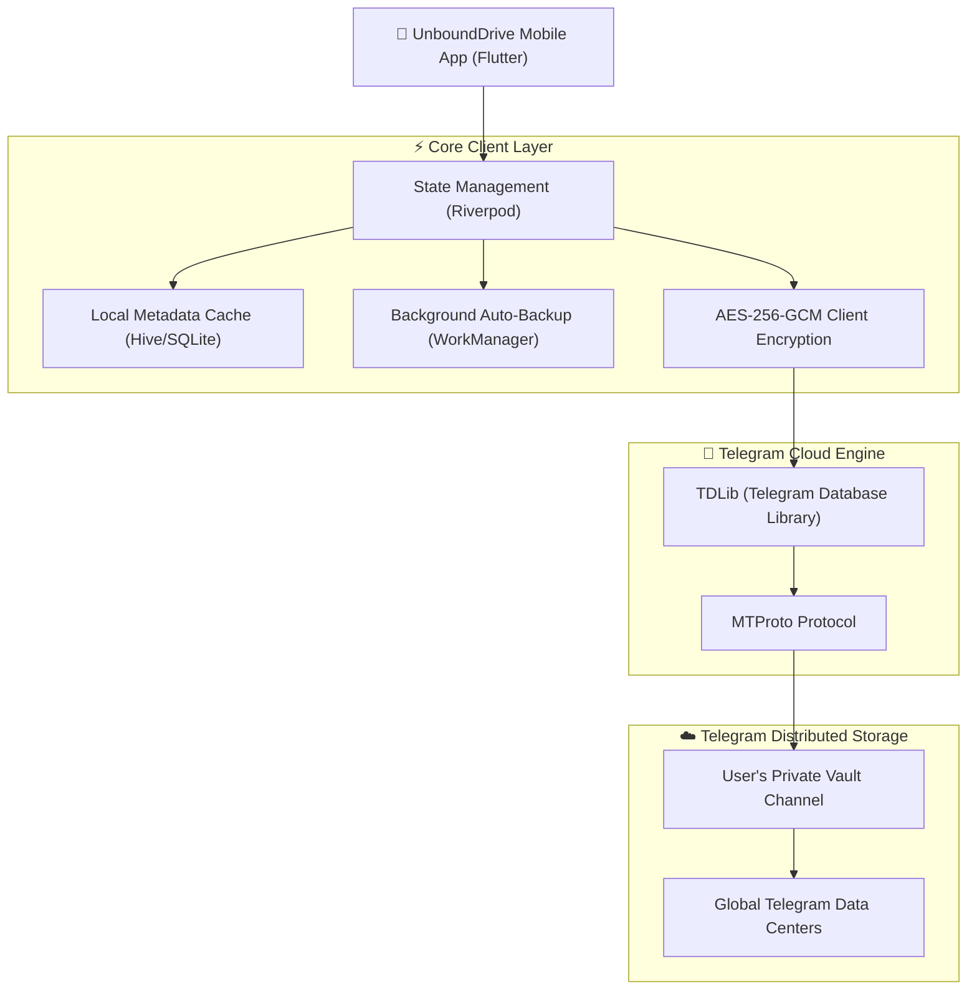

# 🚀 UnboundDrive

> **Storage without limits. Break free from 15GB.**  
> A sleek, privacy-focused, cross-platform mobile cloud drive that transforms Telegram's infinite cloud infrastructure into your personal, subscription-free Google Drive & Google Photos alternative.

[](https://flutter.dev)
[](https://flutter.dev)
[](LICENSE)
[](#)
[](#)

---

## 🌟 Why UnboundDrive?

Tired of getting that annoying notification: *"Your Google storage is 90% full. Upgrade to Google One for $2.99/mo"*? 

Traditional cloud storage providers trap you in recurring monthly fees while locking your personal memories behind arbitrary caps. **UnboundDrive** leverages Telegram's globally distributed, high-speed, and free cloud storage infrastructure to give you a true **personal cloud drive with zero subscriptions**.

---

## ✨ Key Features

- ☁️ **Infinite Cloud Storage:** No 15GB limits. No monthly subscriptions. Store photos, 4K videos, documents, and backups forever.
- 📸 **Smart Auto-Backup:** Runs quietly in the background like Google Photos. Automatically backs up new camera shots and videos when connected to Wi-Fi.
- ⚡ **Turbo Multi-Stream Transfers:** Maximum bandwidth utilization with multi-part parallel uploads and resumable downloads.
- 🔗 **Direct Browser & IDM Sharing:** Generate direct streaming links so anyone can view or download your files with 1 click without needing Telegram or logging in.
- 🔒 **Zero-Knowledge Security (AES-256):** Optional client-side military-grade encryption. Your files are encrypted on your device *before* reaching the cloud—even Telegram cannot read them.
- 🗂️ **Google Drive-Class Organization:** Clean folder trees, instant search, grid/list toggle, and in-app media preview (Photos, Videos, PDFs).
- 🧩 **2GB+ Auto-Chunking:** Seamlessly splits large files (>2GB) during upload and reassembles them automatically on download.

---

## 🏗️ System Architecture



---

## 📂 Project Structure

```
unbounddrive/
├── android/               # Native Android configuration
├── ios/                   # Native iOS configuration
├── lib/
│   ├── app/               # App configuration, themes, routing
│   │   ├── routes.dart
│   │   └── theme/
│   ├── core/              # Core utilities, constants, encryption
│   │   ├── constants/
│   │   ├── security/
│   │   └── utils/
│   └── features/          # Feature-driven modules
│       ├── auth/          # Telegram login (Phone, OTP, 2FA)
│       ├── drive/         # File manager, folder browser, search
│       ├── backup/        # Background auto-sync (Camera, DCIM)
│       └── transfers/     # Upload/Download manager with progress
├── pubspec.yaml           # Dependencies and assets
└── README.md
```

---

## 🚀 Getting Started

### Prerequisites

- [Flutter SDK](https://flutter.dev/docs/get-started/install) (v3.19+)
- Dart SDK (v3.3+)
- Android Studio / Xcode
- Telegram API Credentials ([my.telegram.org](https://my.telegram.org)):
  - `API_ID`
  - `API_HASH`

### Installation

1. **Clone the repository:**
   ```bash
   git clone https://github.com/YOUR_USERNAME/unbounddrive.git
   cd unbounddrive
   ```

2. **Install dependencies:**
   ```bash
   flutter pub get
   ```

3. **Configure Environment:**
   Create a `.env` file in the root directory:
   ```env
   TELEGRAM_API_ID=your_api_id_here
   TELEGRAM_API_HASH=your_api_hash_here
   ```

4. **Run the App:**
   ```bash
   flutter run
   ```

---

## 🔒 Privacy & Legal Notice

UnboundDrive is an independent client that uses the official Telegram API in compliance with Telegram's API Terms of Service. UnboundDrive is not affiliated with, endorsed, or sponsored by Telegram FZ-LLC. Your data is stored directly in your personal Telegram private cloud.

---

## 📄 License

This project is licensed under the MIT License - see the [LICENSE](LICENSE) file for details.
