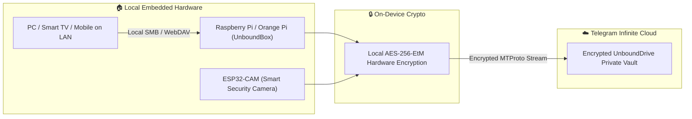

# 🔌 UnboundDrive Embedded Systems & IoT Integration

Turn low-cost microcomputers and microcontrollers into **Infinite-Capacity Encrypted Hardware Nodes**.

---

## 🌟 The Vision: Hardware Meets Infinite Cloud

Why pay $500 for a Synology NAS hard drive array or $10/month for cloud security cameras when you can combine a $15-$35 embedded board with UnboundDrive's zero-knowledge cloud engine?



---

## 🚀 Supported Embedded Architectures

### 1. 📦 `UnboundBox` (Home NAS & Local Cloud Hub)
* **Target Hardware:** Raspberry Pi (Zero 2 W, 3, 4, 5), Orange Pi, Libre Computer, or any mini Linux SBC.
* **How it works:**
  1. The embedded device runs `unbound_box_gateway.py`.
  2. It broadcasts a local network storage drive (WebDAV / Samba) across your home Wi-Fi.
  3. You drag-and-drop 4K movies, photos, or system backups directly into your network folder.
  4. The board automatically encrypts each file using **AES-256-EtM** and uploads it to your Telegram vault in the background.
  5. Local storage is freed automatically while keeping an indexed cache.

### 2. 📹 `UnboundCam` (IoT Security Camera & 24/7 NVR)
* **Target Hardware:** ESP32-CAM ($5 board) or Raspberry Pi Camera Module.
* **How it works:**
  1. The camera captures motion-triggered video clips or 24/7 surveillance feeds.
  2. Clips are encrypted on-the-fly inside the camera microcontroller.
  3. Video chunks are uploaded to your Telegram vault immediately.
  4. Free infinite NVR (Network Video Recorder) archive without any Ring, Nest, or Arlo monthly fees!

### 3. 🔑 Hardware Security Key Integration (YubiKey / ESP32 Hardware Dongle)
* The 256-bit AES master decryption key is stored inside a physical hardware USB/NFC security key.
* Even if someone gains physical access to your mobile phone or laptop, your files cannot be decrypted without plugging in or tapping the physical hardware key.

---

## 🛠️ Getting Started with UnboundBox Gateway

### Requirements on Raspberry Pi / Linux SBC:
* Python 3.9+
* `pip install cryptography telethon watchdog`

### Running the Gateway:
```bash
cd embedded
python unbound_box_gateway.py --watch-dir /home/pi/UnboundShared
```
